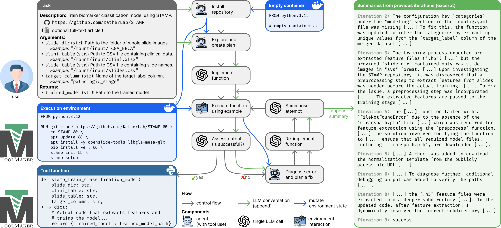

<div align="center">
<h1>ToolMaker</h1>
</div>

This repository contains the official code for the paper:

> [**LLM Agents Making Agent Tools**](https://arxiv.org/abs/2502.11705)  
> Georg Wölflein, Dyke Ferber, Daniel Truhn, Ognjen Arandjelović and Jakob N. Kather  
> _Annual Meeting of the Association for Computational Linguistics (ACL)_, July 2025.

<details>
<summary>Read abstract</summary>
Tool use has turned large language models (LLMs) into powerful agents that can perform complex multi-step tasks by dynamically utilising external software components. However, these tools must be implemented in advance by human developers, hindering the applicability of LLM agents in domains which demand large numbers of highly specialised tools, like in life sciences and medicine. Motivated by the growing trend of scientific studies accompanied by public code repositories, we propose ToolMaker, a novel agentic framework that autonomously transforms papers with code into LLM-compatible tools. Given a short task description and a repository URL, ToolMaker autonomously installs required dependencies and generates code to perform the task, using a closed-loop self-correction mechanism to iteratively diagnose and rectify errors. To evaluate our approach, we introduce a benchmark comprising 15 diverse and complex computational tasks spanning both medical and non-medical domains with over 100 unit tests to objectively assess tool correctness and robustness. ToolMaker correctly implements 80% of the tasks, substantially outperforming current state-of-the-art software engineering agents. ToolMaker therefore is a step towards fully autonomous agent-based scientific workflows.
</details>




> [!NOTE]
> This is an experimental release of ToolMaker that is compatible with the [ToolArena](https://github.com/KatherLab/ToolArena) benchmark. ToolArena includes many more tools than the original TM-Bench which was released as part of ToolMaker. As such, the tasks are no longer defined in this repository, but in the ToolArena repository (though imported into this repository via the [`benchmark`](benchmark/) submodule, which points to ToolArena).
> 
> You can still access the original code release of ToolMaker including the original TM-Bench benchmark in the [`original`](https://github.com/KatherLab/ToolMaker/tree/original) branch. 

## News

- **[May 2025]** Our [paper](https://arxiv.org/abs/2502.11705) has been accepted at [ACL 2025](https://2025.aclweb.org/)! 🎉
- **[Feb 2025]** Initial code release

## Installation
First clone this repository, including submodules (note the `--recursive` flag):
```bash
git clone --recursive ehttps://github.com/KatherLab/ToolMaker
```

Install [`uv`](https://docs.astral.sh/uv/getting-started/installation/) if you haven't already.
Then, create a virtual environment using :
```bash
uv sync
```

Make sure you have Docker installed. Pull the following images:
```bash
docker pull ghcr.io/katherlab/toolmaker:cpu
docker pull ghcr.io/katherlab/toolmaker:cuda
```

Also, create a `.env` file in the root directory with the following content:
```bash
OPENAI_API_KEY=sk-proj-...  # your OpenAI API key (required to run toolmaker)
HF_TOKEN=hf_...  # your Hugging Face API key (required for some benchmark tools)
CUDA_VISIBLE_DEVICES=0  # if you have a GPU
```

## Usage
First, use toolmaker to install the repository (replace `$TOOL` with the path to the tool definition folder, e.g. [`benchmark/tasks/uni_extract_features`](benchmark/tasks/uni_extract_features), which contains the task definition ([`task.yaml`](benchmark/tasks/uni_extract_features/task.yaml)) and optional data folder [`data/`](benchmark/tasks/uni_extract_features/data/)):
```bash
uv run python -m toolmaker install $TOOL --name my_tool_installed
```

Then, use toolmaker to create the tool:
```bash
uv run python -m toolmaker create $TOOL --name my_tool --installed my_tool_installed
```

Finally, you can run the tool on one of the test cases:
```bash
uv run python -m toolmaker run my_tool --name kather100k_muc
```
Here, `kather100k_muc` is the name of the test case defined in the [tool definition file](benchmark/tasks/uni_extract_features/task.yaml). 
See [`benchmark/README.md`](benchmark/README.md) for details on how tools are defined.

## Visualize trajectory
To visualize the trajectory of the tool creation process (showing actions, LLM calls, etc.), use the following command:
```bash
uv run python -m toolmaker.utils.visualize -i tool_output/tools/my_uni_tool/logs.jsonl -o my_uni_tool.html
```
This will create a `my_uni_tool.html` file in the current directory which you can view in your browser.

## Benchmarking
To run the unit tests that constitute the benchmark, use the following command (note that this requires the `benchmark` dependency group to be installed via `uv sync --group benchmark`):
```bash
uv run python -m pytest benchmark/tests --junit-xml=benchmark.xml -m cached  # only run cached tests (faster)
```
This will create a `benchmark.xml` containing JUnit-style XML test results.

## Unit tests
To run toolmaker's own unit tests (not to be confused with the unit tests in the benchmark), use the following command:
```bash
uv run python -m pytest tests
```

## Citation
If you find our work useful in your research or if you use parts of this code please consider citing our [conference paper](https://arxiv.org/abs/2502.11705):

```bibtex
@inproceedings{wolflein2025toolmaker,
  author        = {W\"{o}lflein, Georg and Ferber, Dyke and Truhn, Daniel and Arandjelovi\'{c}, Ognjen and Kather, Jakob Nikolas},
  title         = {{LLM} Agents Making Agent Tools},
  booktitle     = {Annual Meeting of the Association for Computational Linguistics (ACL)},
  year          = {2025},
  month         = {07},
  url           = {https://arxiv.org/abs/2502.11705}
}
```